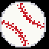

# led-ticker-baseball

MLB scores, standings, promotions, Statcast, and attendance widgets, a rolling-baseball sprite transition, and a `:baseball.ball:` emoji for [led-ticker](https://github.com/JamesAwesome/led-ticker). Live game data comes from MLB's free StatsAPI — no API key required.

## Screenshots


The `:baseball.ball:` emoji (8×8 and the 32×32 hi-res upgrade on bigsign):

 

## Prerequisites

- A working [led-ticker](https://github.com/JamesAwesome/led-ticker) install.
- Internet access on the Pi (the widgets call MLB's free StatsAPI; no API key needed).

## Install

This plugin auto-registers via the `led_ticker.plugins` entry point — once the package is installed, no `[plugins]` config change is needed.

**Into a containerized led-ticker (recommended):** the plugin is already listed in `config/requirements-plugins.example.txt`. Copy that to the live file and rebuild:

```bash
# in your led-ticker checkout
cp config/requirements-plugins.example.txt config/requirements-plugins.txt
docker compose up -d --build
```

That example file lists every first-party plugin — trim the live copy to just the ones you want. The baseball line is:

```text
led-ticker-baseball
```

**Standalone (a venv that already has led-ticker):**

```bash
pip install led-ticker-baseball
```

See the led-ticker [Plugins docs](https://docs.ledticker.dev/plugins/) for the constraint-based install the Docker image uses.

Once installed, the `baseball.scores` / `baseball.standings` / `baseball.promotions` / `baseball.statcast` / `baseball.attendance` widgets, the `baseball.roll*` transitions, and the `:baseball.ball:` emoji are available automatically.

## Widgets

Each widget below is a `[[playlist.section.widget]]` block you add inside a playlist section of your `config/config.toml`. New to led-ticker configs? The [first-config tutorial](https://docs.ledticker.dev/tutorial/02-first-config/) walks through the overall structure — the blocks here show just the baseball-specific keys.

### `baseball.scores`

Fetches live game state for a tracked team and renders its current series. Four `layout` values:

- **`layout = "auto"` (default)** — resolves to the best layout for the sign automatically; see the resolution table below. This is what most configs should use.
- **`layout = "ticker"`** — a scrolling line. Pre-game `NYY @ BOS  Today 7:05 PM`; live `NYY 3 BOS 5 ▲6 ◇◆◇ 1·2·1` (score + inning + bases + balls·strikes·outs in color); final `NYY 4 BOS 5 (Final)` (win green, loss red); postponed `NYY @ BOS (PPD: Rain)`. Spring Training / All-Star games append `(ST)` / `(ASG)`.
- **`layout = "scoreboard"`** — a two-column board: away name+score left, home name+score right, center zone shows inning+outs (top) and B/S count + base diamonds (bottom). Names in brand colors; scores green/red on final; base diamonds yellow (occupied) / dim grey (empty). ABS-challenge dashes appear in the bottom corners when active.
- **`layout = "two_row"`** — a held top band (series title) over a scrolling bottom band (the per-game line). Use the `top_*` font options below to size the top band; sized for bigsign.

**Scale-1 signs (smallsign) always use the original text-glyph renderers** for `scoreboard`/`two_row`/`ticker` — the `font`/`small_font`/`top_font` options below apply there. **Scale>1 signs (bigsign, longboi) use new physical (procedural pixel-art) renderers** for all three layouts — a coordinate-for-coordinate port of the design handoff, deliberately design-pinned (fixed Inter hires text at fixed sizes; no font-name/font-size/threshold knobs; the look isn't user-tunable on scale>1 at all, including `ticker`).

`layout = "auto"` resolves like this:

| Sign | Resolves to |
|------|-------------|
| scale 1 (smallsign) | `ticker` |
| scale>1, real width < 400px (bigsign) | `two_row` |
| scale>1, real width >= 400px (longboi) | `scoreboard` |

Explicit layout names skip resolution and always mean what they say, with one width-fit guard: `layout = "scoreboard"` on a panel narrower than 400 real px (bigsign, 256 real px) degrades to `two_row` instead — the physical scoreboard's fixed anchors assume a >=400px panel and would otherwise silently clip the entire home team's name/score/dashes/bases to nothing. Explicit `layout = "two_row"` (or `"ticker"`) always renders as requested at any width.

> **Migration note:** before this release, the default `layout` was `"ticker"` on every sign. The new default is `"auto"`, which keeps `ticker` on smallsign but switches bigsign/longboi to the new physical `two_row`/`scoreboard` renderers unless you set `layout` explicitly. If you want the old scroll-everywhere behavior back, set `layout = "ticker"` explicitly in your config.

```toml
[[playlist.section.widget]]
type = "baseball.scores"
team = "NYY"
timezone = "America/New_York"  # set to your local timezone
```

**`team` is the only required field** — everything below is optional tuning.

| Option | Type | Default | Description |
|--------|------|---------|-------------|
| `team` | string | required | MLB team abbreviation, 2–3 letters (e.g. `"NYY"`, `"KC"`, `"SD"`) — see [Team codes](#team-codes). Case-insensitive. |
| `layout` | string | `"auto"` | `"auto"`, `"ticker"`, `"scoreboard"`, or `"two_row"` — see the resolution table above. |
| `timezone` | string | `"America/New_York"` | IANA timezone for game-time formatting. |
| `padding` | int | `6` | Horizontal padding (logical px) after each message when scrolling (ticker). |
| `final_hold_hours` | int | `6` | Hours after a game ends to keep showing the final score. |
| `bg_color` | RGB list | none | Background fill behind all game messages. Scale-1 only — the scale>1 physical renderers paint their own fixed palette and ignore it. |
| `font_color` | RGB list / string / table | unset | Override all text color; default keeps per-segment brand/win-loss colors. Scale-1 only, same reason. |
| `font` | string | `"6x12"` | Font for names and scores. Hires name (e.g. `"Inter-Regular"`) needs `font_size`. Scale-1 (smallsign) only — every scale>1 layout (`ticker` included) is design-pinned and ignores all font options. |
| `font_size` | int | none | Point size; required for a hires (TTF/OTF) `font`. Scale-1 only. |
| `font_threshold` | int | `128` | Hires anti-alias threshold (0–255); `80` suits Inter Regular. Scale-1 only. |
| `small_font` | string | same as `font` | Center-zone font, scale-1 `scoreboard` layout only. |
| `small_font_size` | int | none | Point size for `small_font`. Scale-1 only. |
| `small_font_threshold` | int | same as `font_threshold` | Anti-alias threshold for `small_font`. Scale-1 only. |
| `top_font` | string | same as `font` | Top-band font, scale-1 `two_row` layout only. |
| `top_font_size` | int | none | Point size for `top_font`. Scale-1 only. |
| `top_font_threshold` | int | same as `font_threshold` | Anti-alias threshold for `top_font`. Scale-1 only. |
| `top_row_height` | int | half the canvas | Height (logical px) of the held top band, scale-1 `two_row` layout only. |
| `update_interval` | int | `300` | Seconds between StatsAPI fetches. |

> `top_*` options apply only with `layout = "two_row"` (or `"auto"` resolving to `two_row`) — the widget rejects them at config-load under other explicit layouts. All `font`/`small_font`/`top_font*` options are ignored on scale>1 signs (bigsign, longboi) — every layout there, including `ticker`, uses the new design-pinned physical renderers with fixed Inter text. They apply on scale-1 (smallsign) signs regardless of layout.

### `baseball.standings`

Fetches overall MLB standings for the divisions of your tracked `teams`. Three `layout` values:

- **`layout = "auto"` (default)** — resolves per-sign, same idea as `baseball.scores`; see the resolution table below.
- **`layout = "ticker"`** — the original behavior: scrolls `rank. TeamName W-L GB`, each name in its brand color, one row per section visit for a division's teams (top-N plus any tracked `teams` not already in that list, everywhere). Offseason-aware: before the season starts it shows `Opens Mar 27`; between the World Series and Spring Training it keeps the prior final standings.
- **`layout = "board"`** — same as `auto`: a held physical division board (see below). Kept as an explicit synonym alongside `auto` in case a future release gives `auto` its own per-canvas resolution logic; today the two behave identically.

`layout = "auto"` resolves like this:

| Sign | Resolves to |
|------|-------------|
| scale 1 (smallsign) | One scrolling row per section visit, cycling through the division's teams — visually unchanged from the classic `ticker` look. |
| scale>1 (bigsign, longboi) | A held division board (see columns below). |

**Board columns** — bigsign (256px real width) shows rank, team chip, team, combined W-L record, GB, and streak; longboi (512px) adds PCT and L10 (split W/L instead of a combined record). Boards show up to `board_rows` rows per division (default 5). **GB on a board is DIVISION games back** (each team's distance from its own division leader) — the scrolling `ticker` rows keep the overall (league) GB instead.

**Fewer rows, bigger text** — `board_rows` (3-5, default 5) controls how many rows a board shows. Dropping to 4 or 3 rows scales the text/chip size up so a smaller board still fills the panel readably; 5 rows is the original, unscaled size. Ignored by `layout = "ticker"` (it always scrolls one row per section visit regardless of `board_rows`).

**Division selection** — one board per division represented in your `teams` list, in config order, deduped (tracking two teams in the same division still shows that division once). When no tracked team resolves to a division, the board falls back to the overall leader's division.

**Tracked-team pinning** — when `board_rows` cuts a division down (e.g. 3 of its 5 teams), the board still always shows every tracked team in that division: it takes the top `board_rows` by division rank, then swaps in any tracked team outside that cutoff (displacing the lowest-ranked team(s) already selected). The rank digit shown is always the team's TRUE division rank — a board reading `1, 2, 5` is a normal, self-explanatory result of that swap, not a bug.

**Fallback to `ticker`** — if the API response has no division data for any team (a shape the boards can't group), `auto`/`board` fall back automatically to the classic scrolling rows instead of showing nothing (logged at INFO: `standings: no divisions resolved; falling back to ticker rows`).

> **Migration note:** before this release, `baseball.standings` always scrolled rows. The new default `layout = "auto"` keeps that on smallsign but switches bigsign/longboi to the held division board. Set `layout = "ticker"` explicitly to keep the old scrolling-rows behavior on every sign.

```toml
[[playlist.section.widget]]
type = "baseball.standings"
teams = ["NYY", "BOS"]
```

**`teams` is the only required field** — everything below is optional.

| Option | Type | Default | Description |
|--------|------|---------|-------------|
| `teams` | list of strings | required | Tracked team abbreviations (e.g. `["NYY", "BOS"]`); always shown even outside top-N, and determine which division(s) a board covers. |
| `layout` | string | `"auto"` | `"auto"`, `"ticker"`, or `"board"` — see above. |
| `top_n` | int | `3` | Overall top teams to show before tracked teams. `0` = tracked only. `layout = "ticker"` only — boards always show a division's full (capped) roster. |
| `board_rows` | int | `5` | Rows per division board, 3-5. Fewer rows scale the text/chip size up. Tracked teams outside the cutoff are pinned in, displacing the lowest-ranked selected row(s); the rank digit shown is always the true division rank. `layout = "board"`/`"auto"` only — ignored by `"ticker"`. |
| `title` | string | `"MLB Standings"` | Section header before the list. |
| `timezone` | string | `"America/New_York"` | IANA timezone for offseason detection / opening-day date. |
| `padding` | int | `6` | Horizontal padding (logical px) after each message. |
| `bg_color` | RGB list | none | Background fill behind the standings. Applies to `layout = "ticker"` and the scale-1 legacy-row fallback; a scale>1 physical board ignores it, same as `baseball.scores`. |
| `font_color` | RGB list / string / table | unset | Override all text color; default keeps rank white + team brand colors. Same scale-1-only scope as `bg_color` above. **Known limitation:** an animated provider (`"rainbow"`/`"color_cycle"`) renders static on `auto`/`board` layouts at scale 1 — the per-visit row cycling doesn't forward frame-advance hooks to the cycled row. Use `layout = "ticker"` for animated colors on smallsign. |
| `font` | string | `"6x12"` | BDF or hires font for standings text. Applies to `layout = "ticker"` and to the scale-1 legacy-row fallback under `auto`/`board`; a scale>1 physical board ignores it and uses fixed design-pinned text, same as the `baseball.scores` physical renderers. |
| `update_interval` | int | `86400` | Seconds between fetches (24 h default; standings move slowly). |

### `baseball.promotions`

Upcoming home-game promotions — giveaways and theme nights, e.g. the Blue Jays'
Loonie Dogs Night — for a tracked team, from the schedule API's promotions feed.
Shows today's promos when there's a home game today, otherwise the next home
game's — one story per promo, in whichever shape the sign resolves below.
Sponsor tails ("presented by …") are stripped, and near-duplicate feed entries
are collapsed. Promos matching `highlight` render in amber and sort first.
Three `layout` values:

- **`layout = "auto"` (default)** — resolves to the best layout for the sign automatically; see the resolution table below. This is what most configs should use.
- **`layout = "ticker"`** — the hi-res crawl (see below), forced regardless of sign width.
- **`layout = "card"`** — the held card (see below), forced regardless of sign width.

**Scale-1 signs (smallsign) always render the classic scrolling lines**, unchanged by `layout`: one line per promo, team-prefixed, `TOR Jun 22 · Retro Domer Hat Giveaway`. **Scale>1 signs (bigsign, longboi) render one of two new physical (procedural pixel-art) shapes** instead — a coordinate-for-coordinate port of the design handoff, design-pinned same as `baseball.scores`/`baseball.standings`'s physical renderers:

- **Held card** — one promo per story, engine-rotated through the target date's promos (paging dots appear when there's more than one). The narrow (bigsign) card and the wide (longboi) card share the same anatomy: date in amber, promo name in white (auto-scrolling in a clipped band if too long for the card), team chip + `VS <opponent>` in violet, `<offer> · BY <sponsor>` in cyan (either half omitted if the feed doesn't supply it — never invented copy), start time in amber.
- **Hi-res crawl** — the same fields as one continuous scrolling segment run instead of a held card: date, name, chip + VS opponent, offer/sponsor, time, same color scheme as the card.

`layout = "auto"` resolves like this:

| Sign | Resolves to |
|------|-------------|
| scale 1 (smallsign) | classic scrolling lines |
| scale>1, real width < 400px (bigsign) | held card |
| scale>1, real width >= 400px (longboi) | hi-res crawl |

Explicit `layout = "card"` on a longboi (real width >= 400px) still renders — as the wide variant of the held card (the one whose name auto-scrolls in a clipped band rather than a narrower band), not the crawl. Explicit `layout = "ticker"` on a bigsign forces the crawl there too.

```toml
[[playlist.section.widget]]
type = "baseball.promotions"
team = "TOR"
highlight = ["Loonie Dogs"]
```

**`team` is the only required field** — everything below is optional tuning.

| Option | Type | Default | Description |
|--------|------|---------|-------------|
| `team` | string | required | MLB team abbreviation — see [Team codes](#team-codes). Case-insensitive. |
| `layout` | string | `"auto"` | `"auto"`, `"ticker"`, or `"card"` — see above. |
| `highlight` | list of strings | `[]` | Case-insensitive substrings; matching promos render amber and sort first. Applies identically to every layout — scrolling lines, held card, and hi-res crawl all order/color from the same pass. |
| `filter` | list of strings | `[]` | If non-empty, only promos matching one of these substrings are shown. Applies to every layout. |
| `limit` | int | `0` | Max promos shown (`0` = all). Applied after highlight sorting, so highlighted promos are never the ones dropped. Applies to every layout. |
| `lookahead_days` | int | `14` | How far ahead to look for the next home game with promotions. |
| `update_interval` | int | `21600` | Seconds between refreshes (6 h — keeps the "Today" label honest after midnight). |
| `title` | string | `"<Team> Promos"` | Section title override. |
| `timezone` | string | `"America/New_York"` | IANA timezone governing "Today" and date labels. |
| `padding` | int | `6` | Horizontal padding (logical px) after each message when scrolling. |
| `bg_color` | RGB list | none | Background fill behind all messages. Scale-1 only — the scale>1 card/crawl paint their own fixed palette and ignore it, same as `baseball.scores`. |
| `font_color` | RGB list / string / table | unset | RGB list tints the promo names; the team prefix, date label, and amber highlights keep their callout colors. A string/table provider overrides all text, as in the other widgets. Scale-1 only, same reason as `bg_color`. **Known limitation:** an animated provider (`"rainbow"`/`"color_cycle"`) renders static on the scale>1 card/crawl — those layouts are design-pinned colors regardless. |
| `font` | string | `"6x12"` | Display font. Hires name needs `font_size`. Scale-1 only — every scale>1 layout (including `ticker`) is design-pinned and ignores all font options, same as `baseball.scores`. |

With nothing to show, the widget falls back to a team-prefixed
`Next home game: Jun 22` (promo-free homestand), `No home games soon`
(road trip), or `Opens <date>` / `Opens soon` (offseason).

**Known behavior:** promos shown are always the TARGET DATE's — today's home
game if there is one, else the next home game with matching promos (the
widget's longstanding semantics, unchanged by this layout work). A design
mock paged through a whole homestand's worth of games; a lookahead knob for
that is a possible future addition, not present today. Also: a doubleheader
whose two games carry same-named or near-duplicate (prefix) promos now shows
two entries (previously merged into one under the legacy scrolling-lines
view, with the shorter name winning) — each game gets its own card/line/crawl
segment, matching the per-game data the API actually returns.

### `baseball.statcast`

League-wide daily Statcast superlatives — the longest home run, hardest-hit
ball, and fastest/slowest pitch across all of MLB — or, with a `team` set, the
same superlatives scoped to that team's own players.
Re-derived through the day as games progress. One scrolling line per stat with
the value in amber and the record holder's team abbreviation in its brand color:
`Today · Longest HR 463 ft — Butler OAK`. Mornings fall back to yesterday's
finals, labeled with the short date (`6/12 · …`). Data comes from Baseball
Savant's day CSV (an
undocumented endpoint — the widget refreshes at a polite default cadence and
skips the pull entirely when no games are live or newly final).

```toml
[[playlist.section.widget]]
type = "baseball.statcast"
```

**No required fields** — everything below is optional tuning.

| Option | Type | Default | Description |
|--------|------|---------|-------------|
| `team` | string | unset | Scope superlatives to this team's own players (e.g. a Phillies batter for `longest_hr`, a Phillies pitcher for `fastest_pitch`). Omit for league-wide. Case-insensitive — see [Team codes](#team-codes). |
| `layout` | string | `"auto"` | `"auto"`, `"big"`, or `"long"` — see [Hero card + trajectory](#hero-card--trajectory-bigsignlongboi) below. Scale-1 signs ignore this and always render the classic scrolling line. |
| `stats` | list of strings | all four | Which lines to show, in display order: `"longest_hr"`, `"hardest_hit"`, `"fastest_pitch"`, `"slowest_pitch"`. |
| `update_interval` | int | `1800` | Seconds between refreshes (30 min). A ~10 KB schedule check skips the ~3 MB data pull when nothing changed. |
| `title` | string | `"Statcast"` | Section title override. |
| `timezone` | string | `"America/New_York"` | IANA timezone governing "Today" and the day rollover. |
| `padding` | int | `6` | Horizontal padding (logical px) after each message when scrolling. |
| `bg_color` | RGB list | none | Background fill behind all messages. |
| `font_color` | RGB list / string / table | unset | RGB list tints the stat label and name; the day label, amber value, and team abbr keep their callout colors. A string/table provider overrides all text, as in the other widgets. |
| `font` | string | `"6x12"` | Display font. Hires name needs `font_size`. |

The slowest-pitch line appends the pitch name when known (`69.6 mph (Slow
Curve)`) — that's where the eephus and position-player pitching comedy lives.
With no Statcast data for today or yesterday, the widget falls back to
`Next games: Mar 26` (offseason) or `No games soon`; a fetch failure shows
`No Data`.

With a team set, lines lead with the team abbreviation in its brand color and
drop the (now-redundant) trailing one:
`PHI Today · Longest HR 472 ft — Schwarber`. The off-day fallback then names
the team's next game (`Next game: Jun 20`) rather than the league slate.

#### Hero card + trajectory (bigsign/longboi)

**Scale-1 signs (smallsign) always render the classic scrolling line above**,
unchanged by `layout`. **Scale>1 signs (bigsign, longboi) render one story per
superlative as a physical (procedural pixel-art) hero card** instead — a
coordinate-for-coordinate port of the design handoff, same design-pinned
convention as the `baseball.scores`/`baseball.standings`/`baseball.promotions`
physical renderers: player name, the result in its outcome color (green HR,
red out, amber otherwise), exit velo, and — on the wide card — launch angle
and pitch columns alongside a DISTANCE panel.

Two card shapes, chosen by `layout`:

- **`layout = "auto"` (default)** — resolves to the best card for the sign automatically; see the resolution table below. This is what most configs should use.
- **`layout = "big"`** — the narrow (bigsign) card, forced regardless of sign width.
- **`layout = "long"`** — the wide (longboi) card with the animated trajectory panel, forced regardless of sign width.

`layout = "auto"` resolves like this:

| Sign | Resolves to |
|------|-------------|
| scale 1 (smallsign) | classic scrolling line |
| scale>1, real width < 400px (bigsign) | big card |
| scale>1, real width >= 400px (longboi) | long card |

**The big card (bigsign)** shows player, result, exit velo, then a line with
launch angle, distance, and pitch (abbreviation + velo, when the superlative
is a pitch rather than a batted ball), plus an animated trajectory panel in
the empty block under the result label for batted-ball superlatives.

**The long card (longboi)** adds an animated trajectory panel in the
DISTANCE slot for batted-ball superlatives (`longest_hr`, `hardest_hit`): the
ball FLIES the arc over ~1.5s from a standing start each time the card is
shown, then rests at its landing act — one of five, driven by the play's
actual result, never guessed:

- **clears** — a home run; the ball flies past a white wall tick at the
  panel's far edge.
- **fair** — a non-homer hit; the ball comes to rest on the ground mid-panel.
- **track** — a deep out (distance at or past the warning track); the ball
  is caught in front of a dotted amber warning-track line.
- **caught** — a shallower out; the ball rests inside a small grey glove
  ring.
- **grounder** — a ground ball or a launch angle at or below zero; a low
  skip along the ground to a short landing, no arc.

The arc's shape — apex height, where it peaks, how steeply it drops — comes
from the ball's real launch angle, exit velo, and distance, so two home runs
land at genuinely different curves (a lofted moonshot vs. a flatter liner
that runs off the panel edge), while the *same* ball always draws the exact
same arc on replay. **Pitch superlatives (`fastest_pitch`, `slowest_pitch`)
have no launch angle or distance, so the long card skips the arc panel
entirely** and shows the pitch type large in that slot instead.

**Both scale>1 cards draw the arc** — the bigsign fits a compact panel in the
block under the result label; the longboi uses the full-width DISTANCE slot.
Both keep the launch-angle / distance / pitch text as well. Re-entering the
section (a new visit) always flies the ball again from the start; it never
resumes mid-flight or skips straight to the resting pose.

### `baseball.attendance`

Ballpark attendance and conditions. Two modes, chosen by whether you set a
`team`:

- **League-wide** (no `team`): the day's attendance superlatives —
  `Today · Biggest crowd 45,123 — Dodger Stadium`, plus smallest crowd and
  fullest/emptiest park by capacity %. Venue name in the home team's brand
  color.
- **Team** (`team` set): that team's game —
  `TOR · Rogers Centre 41,212 (90%) · 72° Clear, wind 5 mph, In From CF`.
  Attendance and fill % appear once the game is final; venue and weather show
  before that.

```toml
[[playlist.section.widget]]
type = "baseball.attendance"
# team = "TOR"   # set for team mode; omit for league-wide
```

**No required fields** — everything is optional tuning.

| Option | Type | Default | Description |
|--------|------|---------|-------------|
| `team` | string | unset | Set → that team's game; omit → league-wide superlatives. |
| `stats` | list of strings | all four | League mode only, in display order: `"biggest_crowd"`, `"smallest_crowd"`, `"fullest"`, `"emptiest"`. |
| `update_interval` | int | `1800` | Seconds between refreshes (30 min). A ~47 KB schedule check skips the per-game fetches when nothing changed. |
| `title` | string | `"Attendance"` | Section title override. |
| `timezone` | string | `"America/New_York"` | IANA timezone for "Today" / day rollover. |
| `padding` | int | `6` | Horizontal padding (logical px) after each message. |
| `bg_color` | RGB list | none | Background fill behind all messages. |
| `font_color` | RGB list / string / table | unset | RGB list tints body text; the day label, amber value, and venue/team color keep their callout colors. A string/table provider overrides all text. |
| `font` | string | `"6x12"` | Display font. Hires name needs `font_size`. |

Fill % is omitted when a venue lists no capacity (spring sites). With nothing
final yet, the widget shows yesterday's data (short-date labeled, e.g.
`6/12 · …`); with no games at all it shows `Next game: Jun 20` (team) /
`Next games: Jun 20` (league); a fetch failure shows `No Data`.

## Common patterns

Recipes that combine the widgets above. Each block shows just the
baseball-specific keys — drop the widgets into a playlist section of your
`config/config.toml` (see the [first-config tutorial](https://docs.ledticker.dev/tutorial/02-first-config/) for the surrounding structure).

### My-team dashboard

One team across every widget, rotating with the rolling-baseball transition.

```toml
[[playlist.section]]
mode = "slideshow"
transition = "baseball.roll_alternating"
hold_time = 8

[[playlist.section.widget]]
type = "baseball.scores"
team = "TOR"

[[playlist.section.widget]]
type = "baseball.standings"
teams = ["TOR"]

[[playlist.section.widget]]
type = "baseball.promotions"
team = "TOR"

[[playlist.section.widget]]
type = "baseball.attendance"
team = "TOR"
```

Shows your team's current series, its place in the standings, its next
home-game promotions, and the crowd and conditions at its game.

### League roundup

League-wide daily superlatives — omit `team` and both widgets run in league
mode.

```toml
[[playlist.section]]
mode = "slideshow"
hold_time = 8
scroll_step_ms = 35

[[playlist.section.widget]]
type = "baseball.statcast"

[[playlist.section.widget]]
type = "baseball.attendance"
```

Shows the day's longest home run, hardest-hit ball, and fastest and slowest
pitch, then the biggest and smallest crowd and the fullest and emptiest park
across all of MLB.

### Gameday ticker

A minimal single-team scrolling line on any sign — set `layout = "ticker"` explicitly since the default `"auto"` picks a physical `two_row`/`scoreboard` layout on bigsign/longboi instead.

```toml
[[playlist.section]]
mode = "slideshow"
hold_time = 6

[[playlist.section.widget]]
type = "baseball.scores"
team = "NYY"
layout = "ticker"
```

Shows just the tracked team's live, final, or upcoming game line.

### Shared knobs

- Every widget accepts the standard `title`, `font`, `font_color`, `bg_color`,
  `padding`, and `timezone` options — see each widget's table above.
- Put `:baseball.ball:` in a `[playlist.section.title]` message for a themed
  header.
- **Pacing** is tuned with `hold_time` (dwell before and after a line) and
  `scroll_step_ms` (scroll cadence — lower is faster). These are
  [led-ticker section settings](https://docs.ledticker.dev/), not plugin
  options; they control how an overflowing line (common in the statcast,
  attendance, and promotions widgets) reads on the panel.

## Team codes

All 30 teams (used by the scores, standings, promotions, statcast, and attendance widgets):

`ARI` D-backs · `ATL` Braves · `BAL` Orioles · `BOS` Red Sox · `CHC` Cubs · `CIN` Reds · `CLE` Guardians · `COL` Rockies · `CWS` White Sox · `DET` Tigers · `HOU` Astros · `KC` Royals · `LAA` Angels · `LAD` Dodgers · `MIA` Marlins · `MIL` Brewers · `MIN` Twins · `NYM` Mets · `NYY` Yankees · `OAK` Athletics · `PHI` Phillies · `PIT` Pirates · `SD` Padres · `SEA` Mariners · `SF` Giants · `STL` Cardinals · `TB` Rays · `TEX` Rangers · `TOR` Blue Jays · `WSH` Nationals

## Transition

A rolling-baseball sprite transition, registered in three directions:

```toml
transition = "baseball.roll"              # left-to-right
# transition = "baseball.roll_reverse"     # right-to-left
# transition = "baseball.roll_alternating" # alternates each use
```

On a bigsign panel (`default_scale > 1`) the transition automatically renders a hi-res procedurally-rotated ball; on a smallsign it uses the 8-frame lo-res sprite.

## Emoji

`:baseball.ball:` — a white ball with red stitching. Use it inline in any text-bearing widget:

```toml
[[playlist.section.widget]]
type = "message"
text = ":baseball.ball: Play ball!"
```

It renders as an 8×8 sprite, auto-upgrading to a 32×32 hi-res sprite on bigsign.

## Development

Install dev deps and run the checks:

```bash
uv sync --extra dev      # resolves led-ticker-core from PyPI
uv run pytest -q
uv run ruff check src tests
```

The plugin imports only the public `led_ticker.plugin` surface — `tests/test_import_purity.py` enforces it.

## Links

- [led-ticker](https://github.com/JamesAwesome/led-ticker) — the core project
- [Docs site](https://docs.ledticker.dev) · [Plugin system](https://docs.ledticker.dev/plugins/)
